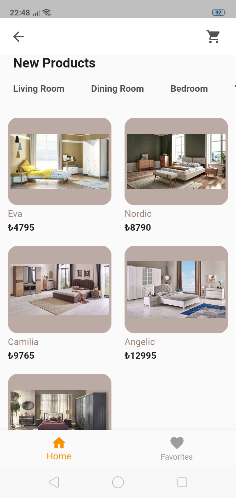
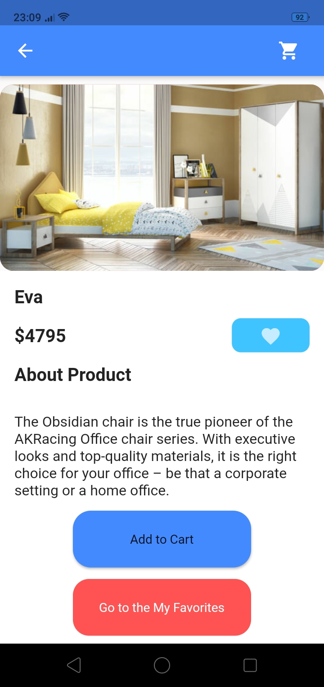
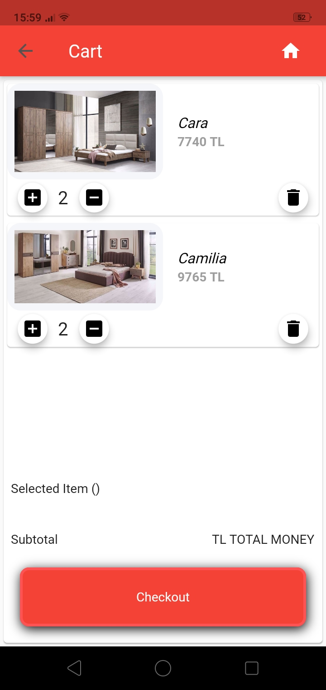
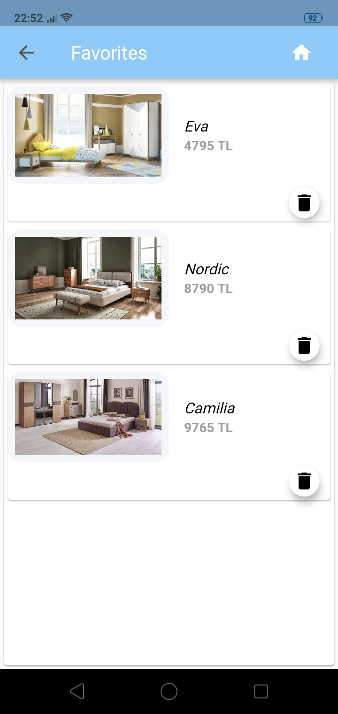

# Flutter_Furniture_App
A Flutter furniture application made in android studio

# Project description

The Flutter Furniture App is a project created by a group of students for learning purposes.

This is a mobile application where furniture products can be displayed and these products can be added to the cart or favorites.

#Features:

- Listing the furniture product in different categories.

- Categories:  Living Rooms, Dining Rooms, Bedrooms, Young Rooms, Home Textile, Carpets

- Can show details of a product, such as price, features, description.

- Products can be added to shopping cart or wish list.  Data stored in local databese and cloud Firestone

# Team members

Batukan DEMİRTAŞ

Orkun Enes EROL

Ali BOZKURT

# Screenshots

